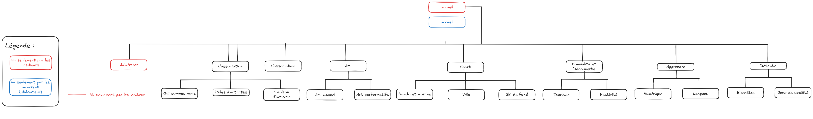

# Cahier des charges

## La présentation du projet

L'association AILE a pour objet d'aider à l'organisation de loisirs collectifs pour ses adhérents.
L'association, dont l'état d'esprit est essentiellement basé sur le Bénévolat et la Convivialité, ne s'adresse qu'aux résidents des communes de Cugnaux, Frouzins, Seysses et Villeneuve-Tolosane.
Les activités proposées par AILE sont très variées allant de la chorale à l'informatique et [plus encore](./image.png).

Le projet est donc de proposer une refonte du site actuel de AILE.

## La définition des besoins et des objectifs du projet

#### Le MVP (Minimum Viable Product)

- Landing page avec la présentation de AILE.
- Système de connexion.
- Avoir la possibilité de gérer les activités à proposer : création, édition, suppression, etc. (en tant qu'admin)
- Pouvoir consulter les différentes activités proposés.
- Pouvoir consulter le site sur un téléphone

#### Les évolutions potentielles

- Refaire les interfaces d'administration (base adhérent et administration site)

## Le choix et la justification de l'architecture

Pour une meilleure expérience utilisateur nous partons sur un choix d'une **SPA** (single page application) en **repository unique** sur un modèle **MVC** (model view controler).

- Les **SPA** sont bien adaptées pour les applications complexes car elles chargent une seule fois et mettent à jour dynamiquement le contenu sans recharger la page.
- En **repository unique** pour une facilité de gestion en groupe tout est au même endroit, faciliter la communication entre le front et le back (tu peux partager des types ou utils).
- Pour une clarté côté back le modèle **MVC** te permet de séparer :

  - Les modèles pour les requêtes DB

  - Les contrôleurs pour la logique métier

  - Les routes pour l’exposition API

  - Facilite la maintenance, les tests, l’évolutivité

## Liste des technologies utilisés

### Technologies Backend

- **PHP**
- **MySQLI**

---

### Technologies Base de Données

- **PHPMyAdmin (MySQL)**

---

### Technologies Frontend

- **PHP**
- **HTML**
- **CSS**
- **Bulma**

---

### Technologies d’Infrastructure

- **Page Perso (de Free)**  
  Ce service de Free nous permet d'avoir la base PHPMyAdmin et de pouvoir déployer le site sur un serveur Apache.

## Cibles visées

Le site vise les adhérent de AILE et les visiteurs qui souhaitent découvrir l'association

## Navigateur compatibles

| Navigateur      | Version stable actuelle | Date de publication |
| --------------- | ----------------------- | ------------------- |
| Google Chrome   | 138.0.7204.8            | 3 juin 2025         |
| Mozilla Firefox | 139.0.1                 | 29 mai 2025         |
| Microsoft Edge  | 137.0.3296.62           | 2 juin 2025         |
| Safari          | 18.5                    | 2025                |

## Arborescence

<!--
## Routes

### Activités

| Méthode  | Endpoint            | Description                   | Accès  |
| -------- | ------------------- | ----------------------------- | ------ |
| `GET`    | `/api/v1/trees`     | Récupérer la liste des arbres | Public |
| `GET`    | `/api/v1/trees/:id` | Détail d’un arbre spécifique  | Public |
| `POST`   | `/api/v1/trees`     | Ajouter un arbre              | Admin  |
| `PATCH`    | `/api/v1/trees/:id` | Modifier un arbre             | Admin  |
| `DELETE` | `/api/v1/trees/:id` | Supprimer un arbre            | Admin  |

### Utilisateur/ authentification

| Méthode  | Endpoint            | Description                                 | Accès       |
| -------- | ------------------- | ------------------------------------------- | ----------- |
| `POST`   | `/api/v1/login`     | Connexion utilisateur                       | Public      | -->

## User stories

| En tant que               | Je veux                                                | Afin de                                                         |
| ------------------------- | ------------------------------------------------------ | --------------------------------------------------------------- |
| En tant que visiteur      | je veux pouvoir consulter la page d'acceuil            | afin de découvrir AILE                                          |
| En tant que visiteur      | je veux pouvoir consulter la page association          | afin de découvrir AILE                                          |
| En tant que visiteur      | je veux pouvoir consulter les activités                | afin de pouvoir faire mon choix                                 |
| En tant que visiteur      | je veux pouvoir consulter la page adhérer              | afin de voir comment adhérer                                    |
| En tant que visiteur      | je veux pouvoir me connecter                           | afin de pouvoir réserver ou se renseigner sur des activités     |
| En tant qu’utilisateur    | je veux pouvoir me consulter la page d'acceuil         | afin de voir les dernière nouvelles et les prochaines activités |
| En tant qu’utilisateur    | je veux pouvoir me déconnecter                         | afin de ne plus être connecter sur mon ordinateur               |
| En tant qu’administrateur | je veux pouvoir ajouter des arbres dans le catalogue   | afin de proposer des nouveaux arbres                            |
| En tant qu’administrateur | je veux pouvoir supprimer des arbres dans le catalogue | afin de retirer des arbres du catalogue                         |
| En tant qu’administrateur | je veux pouvoir modifier des arbres dans le catalogue  | afin de mettre a jour les informations des arbres               |
